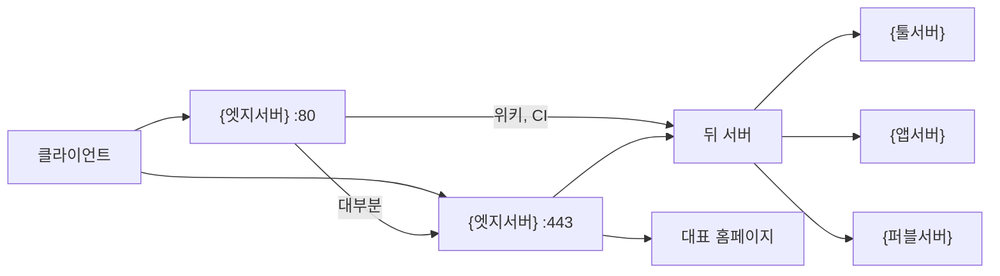

# 엣지 아파치 HTTPS 요청 흐름

> 개발 구간의 엣지는 이름으로 사이트를 고르고, 대표 홈페이지만 직접 응답한 뒤 나머지는 역할별 서버로 넘긴다.

<br>

## 개요

{엣지서버}의 아파치가 80과 443을 받는다. 활성 전달 대상은 {툴서버}, {앱서버}, {퍼블서버}다. 그 외 내부 주소로는 요청을 넘기지 않는다.

대표 도메인과 그 별칭의 홈페이지만 엣지에서 정적 파일로 응답한다. 나머지 이름은 원래 `Host`를 유지한 채 뒤로 전달한다.

**keyword**

- **엣지**: 바깥에서 들어온 요청을 가장 먼저 받는 서버.
- **아파치**: 웹 요청을 받아서, 직접 응답하거나 뒤 서버로 넘기는 프로그램.
- **80**: 주소 앞에 자물쇠가 없는 일반 접속이 들어오는 문.
- **443**: 주소가 https인 암호화 접속이 들어오는 문.
- **별칭**: 본 이름 외에, 같은 사이트를 가리키도록 적어 둔 다른 이름.
- **Host**: 브라우저가 어느 사이트에 접속하는지 알려 주는 이름.

<br>

## 동작 흐름

1. 클라이언트는 {엣지서버}의 80 또는 443으로 온다. 호스트 이름으로 사이트를 고른다.
2. 맞는 이름이 없으면 대표 도메인 사이트가 받는다. 그 사이트의 허용 이름이 아니면 `https://www.{회사도메인}`으로 영구 이동한다.
3. 80에서는 위키와 CI를 제외하면 같은 이름의 HTTPS로 영구 이동한다. 브라우저가 다시 443으로 온다.
4. 443은 이름마다 인증서를 쓴다. TLS는 1.0과 1.1, 그리고 그 이전 SSL을 쓰지 않는다.
5. 전달 대상 사이트는 원래 `Host`를 유지하고, 프로토콜이 HTTPS였음을 뒤에 알린다. 엣지는 임의 목적지로 열어 주는 프록시가 아니다.
6. 인증서 검증 경로는 뒤로 넘기지 않고 엣지에서 받는다.



**keyword**

- **호스트 이름**: 주소에서 www나 서비스 이름처럼, 어느 사이트인지 구분하는 부분.
- **영구 이동**: 브라우저에게 앞으로는 새 주소로 가라고 고정해서 알리는 응답.
- **인증서**: 이 접속의 이름이 맞다는 것을 보여 주는 전자 증명.
- **TLS**: 오가는 내용을 암호화하는 통신 방식. HTTPS가 이 방식을 쓴다.
- **프록시**: 요청을 받아서 정해진 뒤 서버로 대신 전달하는 역할.

<br>

## 개념

### 이름으로 고르기

443의 기본 사이트는 대표 도메인이다. 별칭은 `www.{회사도메인}`, `{회사별칭도메인}`, `www.{회사별칭도메인}`이다. `{계열도메인}`은 `www`를 별칭으로 둔다. 그 외 전달 사이트는 이름과 인증서가 같다.

공통으로 HSTS와 콘텐츠 타입, 프레임, 리퍼러, 기능 제한 헤더를 붙인다. 콘텐츠 보안 정책은 대표 홈페이지에만 있다. 서버 제품 문구는 비우고, 보안 규칙 엔진은 꺼져 있다.

**keyword**

- **HSTS**: 브라우저에게 다음부터는 암호화된 주소로만 접속하라고 알리는 표시.
- **콘텐츠 보안 정책**: 페이지가 그림, 글꼴, 스크립트를 어디에서 가져올 수 있는지 제한하는 규칙.
- **보안 규칙 엔진**: 의심스러운 요청을 검사하는 기능. 이 서버에서는 그 검사를 끄고, 서버 이름 문구만 비운다.

<br>

### 대표 홈페이지

대표 도메인과 별칭은 뒤로 넘기지 않는다. 엣지의 정적 파일을 `GET`과 `HEAD`로만 보여 준다.

**keyword**

- **정적 파일**: 요청마다 새로 만들지 않고, 이미 있는 파일을 그대로 주는 페이지.
- **GET**: 페이지 내용을 보여 달라는 읽기 요청.
- **HEAD**: 내용은 받지 않고, 그 페이지가 있는지만 묻는 요청.

<br>

### 역할별 전달

{툴서버}는 저장소, CI, 이슈 추적, 코드 품질, 위키처럼 개발 도구다. {앱서버}는 서비스 앱이다. {퍼블서버}는 퍼블리시용 이름 하나만 받는다.

대부분의 앱은 경로 전체를 한 포트로 넘긴다. 갈라지는 경우는 셋이다.

- 미디어 경로는 앱 서버의 다른 포트로 가고, 나머지 경로는 본 포트로 간다.
- 실시간 소켓 경로는 웹소켓으로 먼저 보내고, 나머지 페이지는 HTTP로 보낸다. 뒤 서버가 `http://` 주소를 돌려주면 `https://`로 고친다.
- CI와 한 앱은 연결 업그레이드가 웹소켓이면 웹소켓으로 넘긴다. 그 앱은 본문에 남은 내부 주소도 공개 HTTPS·WSS 이름으로 바꾼다.

위키와 CI는 80에서도 바로 뒤로 넘긴다. 나머지는 80에서 HTTPS로 보낸 다음 443이 전달한다.

**keyword**

- **CI**: 코드를 올리면 검사나 배포를 자동으로 이어서 하는 도구.
- **포트**: 한 서버 안에서 서비스끼리 구분하는 번호.
- **웹소켓**: 페이지를 연 뒤에도 연결을 유지하면서 메시지를 주고받는 방식.
- **WSS**: 웹소켓을 HTTPS처럼 암호화한 주소.

<br>

### 출발지 제한

일부 사이트는 로컬, {내부대역}, 적어 둔 {허용공인IP}에서만 연다. 공인 주소 원문은 적지 않는다.

- 코드 품질과 {계열도메인} 계열은 로컬과 {내부대역}만 허용한다.
- 저장소, 이슈 추적, 위키, CI, 한 앱은 각자 허용 목록이 있다.
- 실시간 화면과 미디어가 갈라지는 앱은 443에서 출발지를 열어 둔다.
- 허용 목록이 있는 그 앱도 인증서 검증 경로는 밖에서도 연다.

**keyword**

- **출발지**: 요청을 보낸 쪽의 주소.
- **내부대역**: 회사 안에서만 쓰는 주소 범위.
- **허용 목록**: 통과시킬 주소를 적어 둔 명단.

<br>

## 사용 방법

적용 중인 이름과 목적지를 볼 때는 서버를 재시작하지 않고 가상 호스트 목록만 조회한다.

```bash
apache2ctl -S
```

80에서 HTTPS로 보내는 사이트는, 브라우저 기준으로 443 규칙이 실제 전달이다.

**keyword**

- **가상 호스트**: 서버 하나에서 이름별로 나눠 둔 사이트 설정.

<br>

## 주의·제한

- 이 글은 지금 받는 요청 경로만 다룬다. 서비스를 재시작하거나 설정을 바꾸지 않았다.
- 준비만 되어 있고 활성화되지 않은 이름은 요청을 받지 않는다.
- 허용 목록의 공인 주소는 설정 안에만 둔다.
