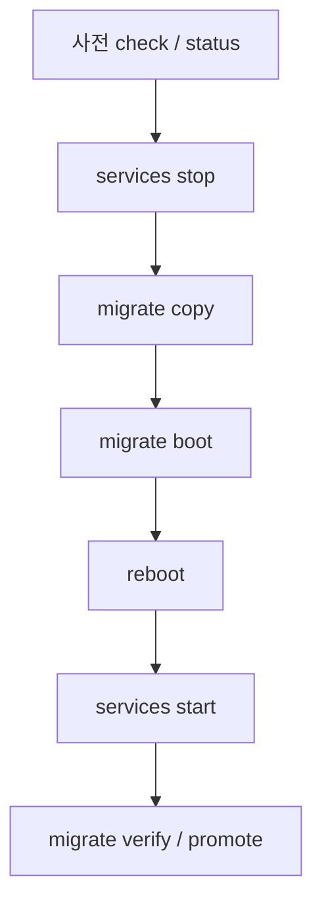

# OS를 HDD에서 SSD로 옮기기 — 툴 서버 이관 키트

> 재설치 없이 HDD 위 Ubuntu를 SSD로 복사하고 UEFI 부팅을 SSD로 맞추는 스크립트·가이드 묶음이다. 대상은 OS를 HDD에 올려 둔 **툴·앱 서버**이며, DB 전용 서버는 디스크 교체 범위가 아니다.

## 개요

일부 서버는 용량이 큰 HDD에 OS와 Docker·Jenkins 데이터를 함께 두고, SSD에는 예전 OS만 남아 있는 경우가 있다. 이 폴더는 **서비스를 멈춘 뒤 한 번에 복사**하고, SSD에 fstab·GRUB·스왑을 맞춘 다음 재부팅·검증하는 절차를 자동화한다. HDD는 롤백용으로 남기며, 이관 스크립트가 HDD 파일을 삭제하지 않는다.

136(앱)과 같은 두 단계 복사(서비스 켠 채 1차 → 정지 후 2차) 대신, **135(툴)은 다운타임을 받고 1회 복사**로 단순화했다.

## 구성

| 파일 | 역할 |
|------|------|
| `tool-server_services.sh` | GitLab·Redmine·SonarQube·Wiki·Jenkins 등 정지·시작·상태 |
| `tool-server_ssd_migrate.sh` | 사전 확인, 복사, 부팅 설정, 검증, 고정, 롤백 |


파일명의 `tool-server` 은 실제 툴 서버 호스트명에 맞게 바꿔 쓴다.

## 디스크 구분·사전 확인

### SSD / HDD 빠르게 보기

```bash
lsblk -d -o NAME,ROTA,SIZE
```

| `ROTA` | 의미 |
|--------|------|
| `0` | 회전하지 않음 → **SSD** |
| `1` | 회전 디스크 → **HDD** |

파티션까지 보려면:

```bash
lsblk -o NAME,SIZE,MODEL,ROTA,FSTYPE,MOUNTPOINT
```

일반적인 UEFI 구성 예: `{디스크}1`은 EFI(vfat, 약 1GB), `{디스크}2`는 루트(ext4).

### 사전에 적어 둘 것

- `lsblk -f`: SSD/HDD, 파티션, `{디스크UUID}`, UEFI 여부
- HDD 사용량이 SSD 루트 파티션 용량 이내인지
- `/etc/fstab`, 네트워크, systemd·Docker·수동 기동 스크립트 위치
- **134(DB)** 는 135/136이 DB를 쓰는 동안 점검 창에만 넣으면 되고, 세 대를 동시에 내릴 필요는 없다

### SSD만 읽기로 확인 (마운트 → 확인 → 언마운트)

```bash
sudo mkdir -p /mnt/ssd-ro
sudo mount -o ro /dev/{SSD루트파티션} /mnt/ssd-ro
cat /mnt/ssd-ro/etc/os-release
cat /mnt/ssd-ro/etc/hostname
df -hT /mnt/ssd-ro
sudo umount /mnt/ssd-ro
sudo rmdir /mnt/ssd-ro
```

## 동작 흐름



| 단계 | 요약 |
|------|------|
| 준비 | tmux 세션, 스크립트를 서버 `{작업디렉터리}` 에 업로드 |
| 0~1 | `status`, `check` — 변경 없음 |
| 2 | 서비스·타이머·Docker 정지, 목록 기록 |
| 3 | SSD 파티션만 포맷(확인 후) → rsync 복사 |
| 4 | SSD fstab·스왑·GRUB, 다음 1회 SSD 부팅 예약 |
| 5 | 재부팅 (USB 제거) |
| 6 | 컨테이너·포트·Jenkins 보완 기동 |
| 7 | SSD 부팅·데이터 검증, 필요 시 `promote` |

**중요:** `boot` 는 **같은 부팅 세션에서 끝난 `copy`** 만 인정한다. `copy` 와 `boot` 사이에 재부팅하면 `stop` → `copy` → `boot` 를 다시 한다(재복사는 변경분만).

## 핵심 내용

### 이관 원칙 (135·136 공통 개념)

1. **사전 확인** — 디스크·용량·부팅 방식·서비스 위치
2. **쓰기 중지 후 복사** — 앱/툴 서비스 중지 후 최종 동기화
3. **SSD만 파티션·포맷** — HDD 부트로더·데이터는 건드리지 않음
4. **SSD로 부팅 설정 후 재부팅** — fstab·GRUB·(UEFI) 부팅 순서
5. **SSD에서 확인 후 서비스** — `findmnt`, `lsblk`로 루트 디스크 확인; systemd/Docker는 부팅 시 자동, 수동 스크립트만 보완
6. **HDD는 검증 후에만 정리** — 문제 시 HDD로 다시 부팅 가능해야 함


```bash
rsync -aAXHx --numeric-ids --delete --info=progress2 ...
```

`--delete` 는 **복사 대상(SSD) 쪽**에서, 원본(HDD)에 없는 파일을 지운다. **HDD 파일을 지우지 않는다.**

- 첫 복사: SSD를 새로 만들었으면 지울 대상이 거의 없다.
- `copy` 재실행: HDD와 맞추기 위해 SSD에만 남은 예전 복사본을 제거한다.

제외 경로(`/proc`, `/sys`, `/dev`, `/run`, `/tmp`, `/mnt`, `/boot/efi`, 스왑 파일 등)는 복사·비교에서 빼며, HDD 전용 보관 파일(`fstab.hdd` 등)도 `--delete` 대상에서 제외한다.

### 스크립트 역할

**`services.sh`**

| 서브커맨드 | 역할 |
|------------|------|
| `stop` | 컨테이너·Jenkins·타이머·cron·Docker 정지 (apt 작업 중이면 거부) |
| `start` | Docker, GitLab healthy·포트 대기, Jenkins(`start.sh`), cron·타이머 |
| `status` / `save` | 상태 조회, 기동 목록 저장 |

**`ssd_migrate.sh`**

| 서브커맨드 | 역할 |
|------------|------|
| `check` | 디스크 모델·SMART·용량·서비스 경로 (읽기 전용) |
| `copy` | SSD 초기화 확인 후 rsync, 재시도·차이 비교 |
| `boot` | SSD fstab·8GB 스왑·GRUB·BootNext |
| `verify` | SSD 부팅·데이터·포트 체크리스트 |
| `promote` | SSD에서만 — 기본 부팅 순서를 SSD 우선으로 |
| `rollback` | HDD 예약 취소 또는 다음 1회 HDD 부팅 |

디스크는 `sda`/`sdb` 이름이 아니라 **모델명**(예: SSD 870 계열, WDC HDD 계열)으로 찾는다.

### 부팅 확인 명령

현재 루트가 SSD인지:

```bash
findmnt -no SOURCE /
lsblk -no MODEL /dev/{루트디스크}
```

또는:

```bash
findmnt -no SOURCE /; lsblk -no MODEL "$(findmnt -no SOURCE /)"
```

펌웨어 순서·다음 부팅:

```bash
efibootmgr | grep -E 'BootOrder|BootNext|BootCurrent'
```

## 사용 방법

```bash
ssh {계정정보}@{IP주소}
tmux new -s ssd
cd {작업디렉터리}

sudo bash tool-server_services.sh status
sudo bash tool-server_ssd_migrate.sh check
sudo bash tool-server_services.sh stop
sudo bash tool-server_ssd_migrate.sh copy
sudo bash tool-server_ssd_migrate.sh boot
sudo reboot

# 재부팅 후
tmux new -s ssd
cd {작업디렉터리}
sudo bash tool-server_services.sh start
sudo bash tool-server_ssd_migrate.sh verify   # 통과 후 y → promote
# 또는
sudo bash tool-server_ssd_migrate.sh promote
```

`check` / `status` 는 서비스를 멈추지 않는다. 로그만 `/root/ssd-migrate/`, `/root/services-state/` 에 쌓인다.

## 주의·제한

| 항목 | 내용 |
|------|------|
| HDD 보존 | `mkfs`·`--delete` 대상은 SSD. HDD는 롤백용 |
| HDD SATA | 링크 불안·속도 저하 시 복사 중 rsync 재시도·`copy-summary.log` 의 SATA 오류 수 확인 |
| 커널 변경 | 이관 재부팅 시 기본 커널이 바뀔 수 있음 — GRUB 메뉴 5초, Advanced에서 이전 커널 선택 |
| UEFI 항목 이름 | HDD·SSD 항목이 모두 `Ubuntu`로 보일 수 있음 — `{PARTUUID}`·디스크 모델로 구분 |
| **펌웨어가 BootOrder를 되돌림** | `efibootmgr -o` / `promote` 만으로는 재부팅마다 HDD가 앞설 수 있음. **BIOS에서 SSD를 Boot Option #1** 으로 두거나, `systemctl reboot --firmware-setup` 으로 설정. 임시로 `efibootmgr -A -b {HDD부팅번호}` 후 `efibootmgr -n {SSD부팅번호}` 로 1회 SSD 부팅 가능 |
| `copy` ↔ `boot` | 같은 부팅 안에서 이어서 실행 |
| overlay 검사 | 일부 `findmnt` 버전은 결과 없어돀로 exit 0 — 스크립트는 출력 유무로 판단하도록 수정됨 |
| wiki 검증 | Wiki.js는 DB({DB서버 IP})에 본문 저장 — 컨테이너 볼륨이 비어 있어도 서비스는 정상일 수 있음 |

### 되돌리기 (요약)

- copy 전 중단 → `services.sh start`
- SSD 부팅 실패 → 전원 재시동 시 HDD 우선이면 HDD에서 `start`
- SSD 운영 중 문제·고정 전 → 재부팅만 하면 HDD 순서일 수 있음
- `rollback` — HDD로 1회 부팅 예약 또는 BootNext 취소

## 참고

- `tool-server_ssd_migration.md` — 상세 단계·로그 표
- `tool-server_manual.md` — 오류 메시지별 확인 방법
- `tool-server_services.sh`, `tool-server_ssd_migrate.sh` — 구현본

이관 성공 기준(스크립트): `/root/ssd-migrate/checklist.log` 의 **결과: 통과**. 펌웨어까지 SSD 고정이 필요하면 재부팅 후에도 `/dev/{SSD루트}` 인지 반드시 확인한다.
